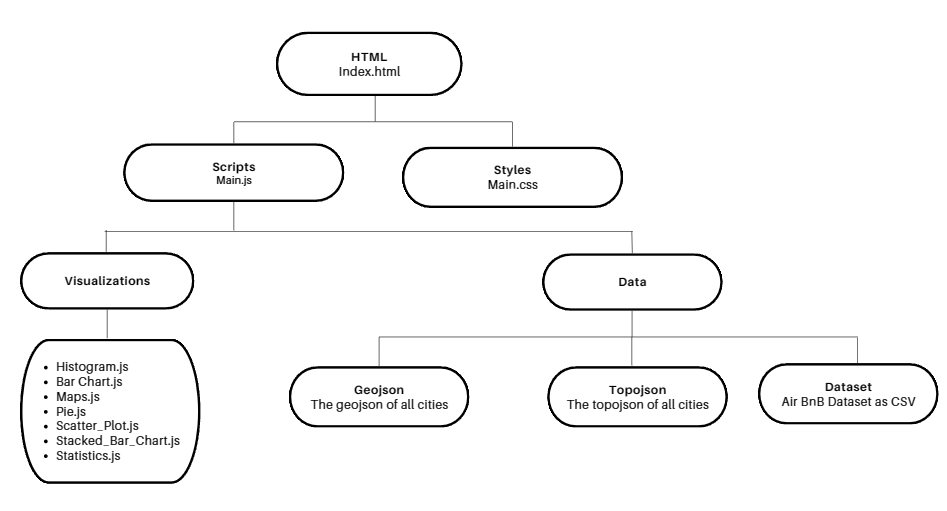

# European AirBnB Dashboard

The European AirBnB Dashboard is a web application developed using D3.js for data visualization. The dashboard provides users with interactive visualizations to explore and analyze European AirBnB data. It includes various charts and maps for comprehensive data exploration.

## Features

- **Multiple Visualizations:** Includes maps, pie charts, bar charts, scatter plots, and histograms for comprehensive data exploration.
- **Filtering:** Users can filter data based on different criteria such as price, day, occupancy, purpose, bedroom count, room type, and host requirements.
- **Interactive Maps:** Users can drill down into specific cities on the map to view more detailed information and statistics.

## Getting Started

To run the web application locally, follow these steps:

1. Clone this repository to your local machine.
2. Navigate to the project directory.
3. With VSCode installed, right-click the folder and open the directory.
4. Go to extensions and install the `ritwickdey.LiveServer` extension.
5. Once the extension is installed, click the `Go Live` button while the `index.js` folder is open and in focus.

## Usage

Once the application is launched, users will encounter an interactive dashboard showcasing many visualizations. Here's how to navigate and utilize the features:

- **Explore Visualizations:** Explore the different charts and maps presented on the dashboard.
- **Filter Data:** Use the filtering options on the left side of the dashboard to tailor the displayed data according to your interests.
- **Interactive Maps:** Click on map pins to drill down into specific cities or hover on charts to access more detailed information.

## Application Architecture

The architecture of the application is structured as follows:

- **index.html:** Serves as the main entry point for the application and anchors all our visualizations.
- **images folder:** Contains the image of map pins.
- **styles folder:** Contains the CSS styling files of the dashboard.
- **data folder:** The data folder contains the Airbnb data as a CSV file.
  - **topojson folder:** Contains TopoJsons for each city.
- **scripts folder:** The scripts folder contains the JavaScript logic for managing the visualization dashboard.
  - **main.js:** Orchestrates the loading of data, initializing and updating the dashboard's charts, managing filters, and handling the back button functionality.
    - **visualizations folder:** Contains scripts for each individual visualization:
        - **Maps.js:** Integrates interactive maps for geographic data exploration.
        - **Statistic.js** Displays summary statistics for data analysis.
        - **StackedBarChart.js:** Creates a stacked-bar-chart to compare total values and category contributions.
        - **Histogram.js:** Creates a histogram to display numerical data distributions.
        - **Pie.js:** Creates pie chart to represent data distribution.
        - **BarChart.js:** Creates a bar-chart to visualize categorical data.
        - **ScatterPlot.js** Creates a scatter-plot to visualize relationships between variables.

On page load, `index.html` loads a the `main.js`, which then processes the CSV file and triggers the `start` function in `main.js` to display the default dashboard layout. Filters are assigned in each chart, and any unused elements are hidden. When filters are applied, respective inner functions are triggered to filter the data. The back button reverts to the initial state by recalling the `start` function.

## Dependencies:
Dependencies include [D3.js](https://d3js.org/) for data visualization and [TopoJson Client](https://github.com/topojson/topojson-client/releases/tag/v3.1.0) for map integration.

## References:
1. The Distillery for the conversion of GeoJson to TopoJson. Available at: [https://shancarter.github.io/distillery/](https://shancarter.github.io/distillery/)
2. Mapshaper  for the conversion of Shapefiles to TopoJson. Available at: [https://mapshaper.org/](https://mapshaper.org/)
3. Geojson.io to view TopoJsons overlayed on maps. Available at: [https://geojson.io](https://geojson.io)
4. Europe TopoJson. Available at: [https://github.com/leakyMirror/map-of-europe/blob/master/TopoJSON/europe.topojson](https://github.com/leakyMirror/map-of-europe/blob/master/TopoJSON/europe.topojson)
5. Various TopoJsons for Europian cities. Available at: [https://cartographyvectors.com/map/601-rome-rioni](https://cartographyvectors.com/)
6. The D3 Graph Gallery which provided many examples of chart implementations, including tooltip using D3.js. Available at: [https://d3-graph-gallery.com/](https://d3-graph-gallery.com/)
8. F20DV Lab Material provided a strong base for many of the visualizations including map, histogram, barchart, bubble and scatterplot. 

Link to GitLab: [Airbnb Europe Dashboard - F21DV](https://gitlab-student.macs.hw.ac.uk/dv_grp8/f21dv-group-project)

